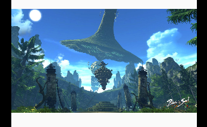
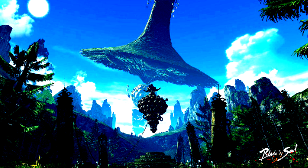
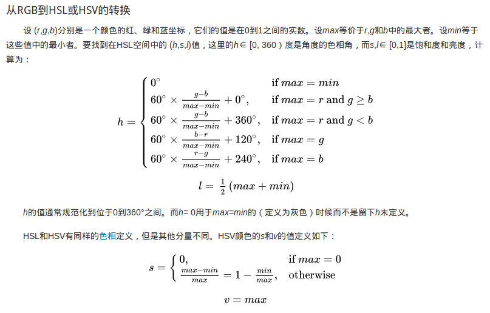
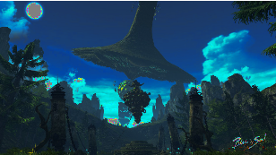

### 数字图像处理领域中常见的几种色彩模式

在数字图像处理过程中，常见的几种色彩模式有RGB, HSL\HSV和YCrCb(YUV)

RGB: 通过对红(R), 绿(G), 蓝(B)三个颜色通道的变化和叠加来得到其它颜色．三个分量的范围都是[0, 255]

HSL\HSV: 将RGB色彩模式中的点在圆柱坐标系中进行表述，  
分为色相(Hue), 饱和度(Saturation), 亮度(Lightness)\明度(Value)三个通道，  
1. 色相(H): 色彩的基本属性，就是日常所说的颜色名称，如红色、黄色等, 取值范围为[0, 360)
2. 饱和度(S): 色彩的纯度，越高色彩越纯，低则逐渐变灰，取值范围[0, 100%]
3. 明度(V)，亮度(L): 像素灰度值的强度，亮度越高则图像越发白，否则图像越黑, 取值范围[0, 100%]

YCrCb:  
1. Y:明亮度，像素灰度值的强度
2. Cr:红色值与亮度的差异
3. Cb:蓝色值与亮度的差异

Cr和Cb代表的是色度，描述影像色彩和饱和度，用于指定像素的颜色

在数字图像处理中，选择合适的色彩模式往往能达到事半功倍的效果  
此处以Android平台上操作图像的亮度，对比度和饱和度来进行说明
1. 亮度：像素灰度值的强度，亮度越高则图像越发白，否则图像越黑；
2. 饱和度：色彩的纯度，越高色彩越纯越亮，低则逐渐变灰变暗；
3. 对比度：图像中像素之间的差异，对比度越高图像细节越突出，反之细节不明显

从上面的概念上来看，如果要操作图像的亮度和饱和度，那么在HSL\HSV色彩空间中进行是最方便的，
直接操作相应的分量即可；而对比度的操作可以直接在RGB色彩空间中进行．

在Android中，我们用ImageView显示一张图片



然后拿到ImageView内部的bitmap对象
```
(imageView.drawable as BitmapDrawable).bitmap
```

从bitmap中获取RGB数据
```
    fun fetchRgbaFromBitmap(bitmap: Bitmap): IntArray {
        val buffer = ByteBuffer.allocate(bitmap.byteCount).order(ByteOrder.nativeOrder())
        bitmap.copyPixelsToBuffer(buffer)
        val rgbaArr = buffer.array()
        val rgba = IntArray(rgbaArr.size)
        val count = rgbaArr.size / 4
        for (i in 0 until count) {
            rgba[i * 4] = rgbaArr[i * 4].toInt() and 0xff           // R
            rgba[i * 4 + 1] = rgbaArr[i * 4 + 1].toInt() and 0xff   // G
            rgba[i * 4 + 2] = rgbaArr[i * 4 + 2].toInt() and 0xff   // B
            rgba[i * 4 + 3] = rgbaArr[i * 4 + 3].toInt() and 0xff   // A
        }
        return rgba
    }
```

RGB色彩空间中调整对比度，调整对比度的算法很多，此处只是一个简单的处理：
1. R, G, B分量除255做归一化处理
2. ((归一化的分量 - 0.5) * 饱和度系数 + 0.5) * 255

核心代码:
```
            val count = originBitmapRgba!!.size / 4
            for (i in 0 until count) {
                var r = originBitmapRgba!![i * 4]
                var g = originBitmapRgba!![i * 4 + 1]
                var b = originBitmapRgba!![i * 4 + 2]
                val a = originBitmapRgba!![i * 4 + 3]

                val cr = ((r / 255f) - 0.5f) * CONTRACT_RATIO
                val cg = ((g / 255f) - 0.5f) * CONTRACT_RATIO
                val cb = ((b / 255f) - 0.5f) * CONTRACT_RATIO

                r = ((cr + 0.5f) * 255f).toInt()
                g = ((cg + 0.5f) * 255f).toInt()
                b = ((cb + 0.5f) * 255f).toInt()

                val newColor = Color.rgb(
                    Util.clamp(r, 0, 255),
                    Util.clamp(g, 0, 255),
                    Util.clamp(b, 0, 255)
                )
                ColorUtils.setAlphaComponent(newColor, a)
                tmpBitmapPixels!![i] = newColor
            }
```
对比度系数CONTRACT_RATIO为1.5的效果


对比度系数CONTRACT_RATIO为3的效果，可以看到图像细节更突出，画面更有层次感



亮度和饱和度的调节也可以在RGB色彩空间中进行，有相应的算法，
此处先将RGB转化到HSL色彩空间，然后根据系数对用S分量和L分量进行调节即可

从RGB到HSL\HSV的转换算法如下(摘自百度百科)：



从HSL\HSV到RGB的转化算法，详情百度百科．．．

Android中RGB和HSL的相互转化，SDK已经帮我们实现好了, ColorUtils#RGBToHSL:

```
/**
     * Convert RGB components to HSL (hue-saturation-lightness).
     * <ul>
     * <li>outHsl[0] is Hue [0 .. 360)</li>
     * <li>outHsl[1] is Saturation [0...1]</li>
     * <li>outHsl[2] is Lightness [0...1]</li>
     * </ul>
     *
     * @param r      red component value [0..255]
     * @param g      green component value [0..255]
     * @param b      blue component value [0..255]
     * @param outHsl 3-element array which holds the resulting HSL components
     */
    public static void RGBToHSL(@IntRange(from = 0x0, to = 0xFF) int r,
            @IntRange(from = 0x0, to = 0xFF) int g, @IntRange(from = 0x0, to = 0xFF) int b,
            @NonNull float[] outHsl)
```

ColorUtils#HSLToColor:
```
 /**
     * Convert HSL (hue-saturation-lightness) components to a RGB color.
     * <ul>
     * <li>hsl[0] is Hue [0 .. 360)</li>
     * <li>hsl[1] is Saturation [0...1]</li>
     * <li>hsl[2] is Lightness [0...1]</li>
     * </ul>
     * If hsv values are out of range, they are pinned.
     *
     * @param hsl 3-element array which holds the input HSL components
     * @return the resulting RGB color
     */
    @ColorInt
    public static int HSLToColor(@NonNull float[] hsl)
 ```

调整饱和度核心代码：
```
val count = originBitmapRgba!!.size / 4
for (i in 0 until count) {
   val r = originBitmapRgba!![i * 4]
   val g = originBitmapRgba!![i * 4 + 1]
   val b = originBitmapRgba!![i * 4 + 2]
   val a = originBitmapRgba!![i * 4 + 3]
   ColorUtils.RGBToHSL(r, g, b, hsl)
   val s = hsl[1]  * SATURATION_RATIO
   hsl[1] = Util.clamp(s,0f, 1f)
   val newColor = ColorUtils.HSLToColor(hsl)
   ColorUtils.setAlphaComponent(newColor, a)
   tmpBitmapPixels!![i] = newColor
}
```

饱和度系数SATURATION_RATIO为1.5的效果, 可以看到图像变亮变纯


饱和度系数SATURATION_RATIO为0.5的效果，可以看到图像变暗变灰


调整亮度核心代码：
```
val count = originBitmapRgba!!.size / 4
for (i in 0 until count) {
   val r = originBitmapRgba!![i * 4]
   val g = originBitmapRgba!![i * 4 + 1]
   val b = originBitmapRgba!![i * 4 + 2]
   val a = originBitmapRgba!![i * 4 + 3]
   ColorUtils.RGBToHSL(r, g, b, hsl)
   hsl[2] = hsl[2] * LIGHTNESS_RATIO
   val newColor = ColorUtils.HSLToColor(hsl)
   ColorUtils.setAlphaComponent(newColor, a)
   tmpBitmapPixels!![i] = newColor
}
```

亮度系数LIGHTNESS_RATIO为1.5的效果, 可以看到图像整体发白


亮度系数LIGHTNESS_RATIO为0.5的效果，可以看到图像整体变黑了


